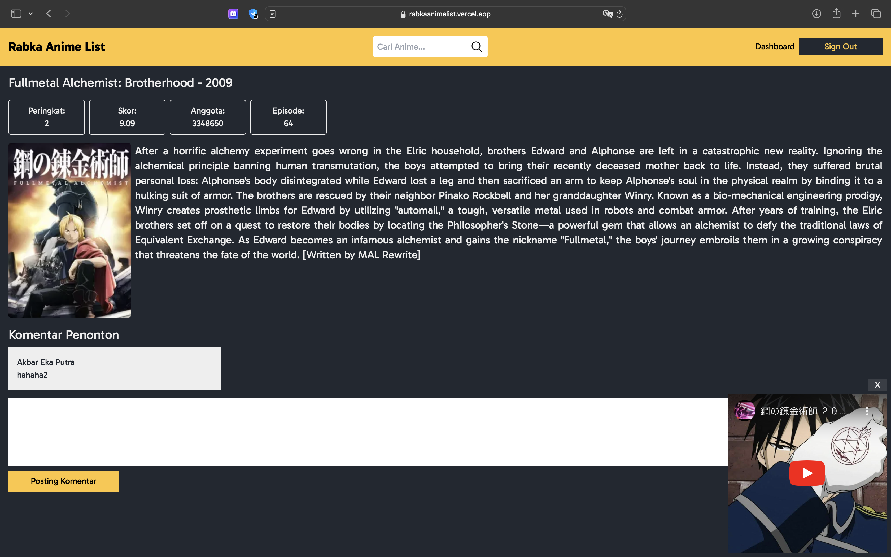
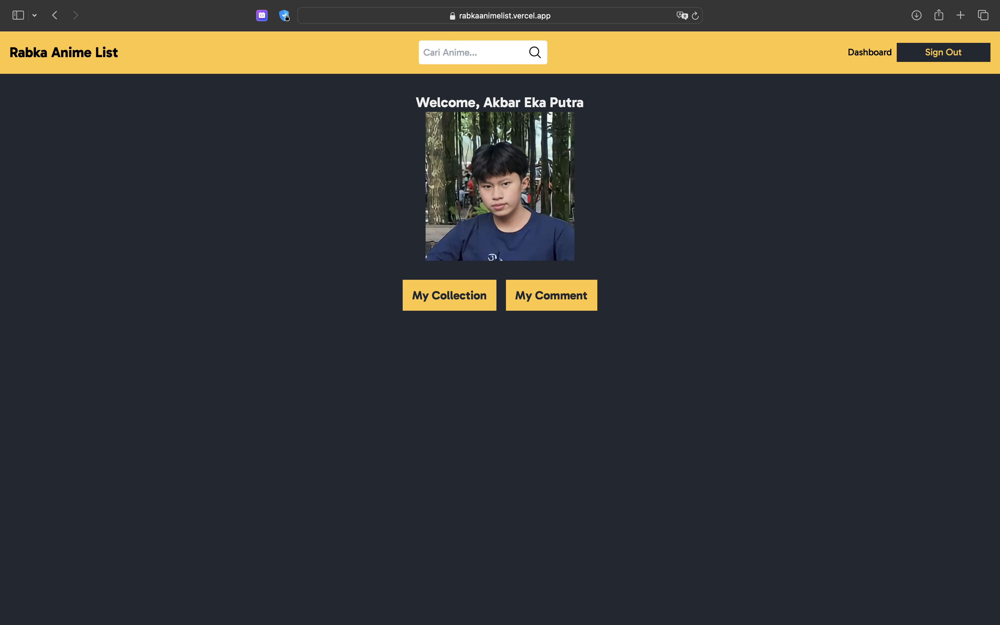
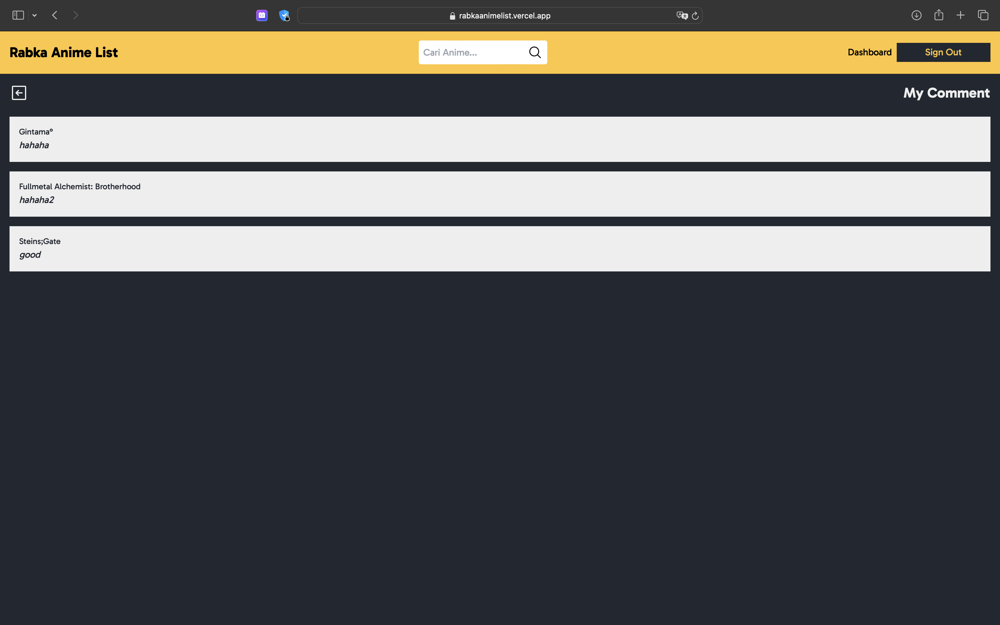
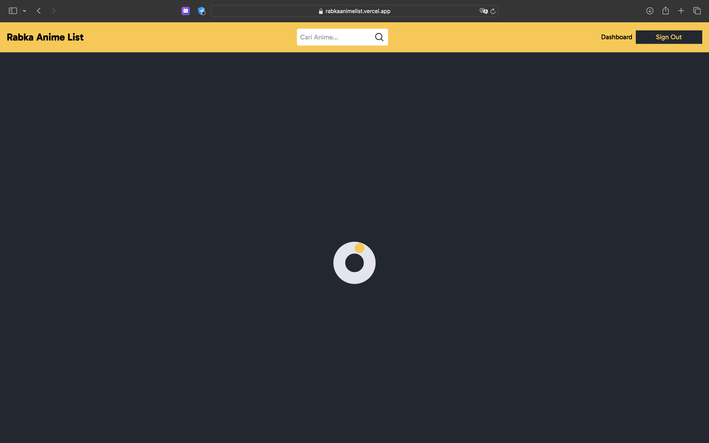
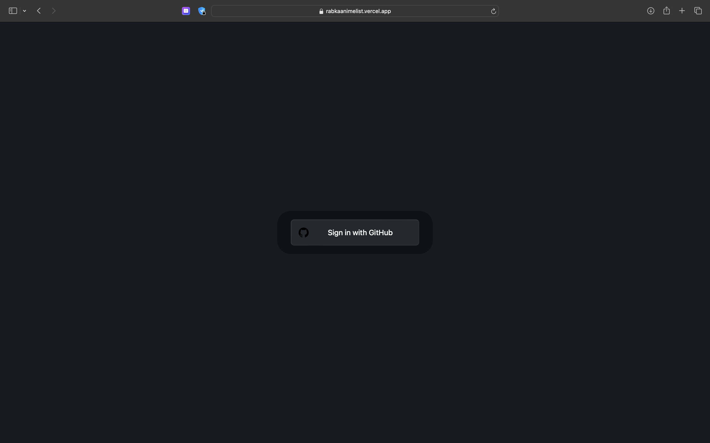
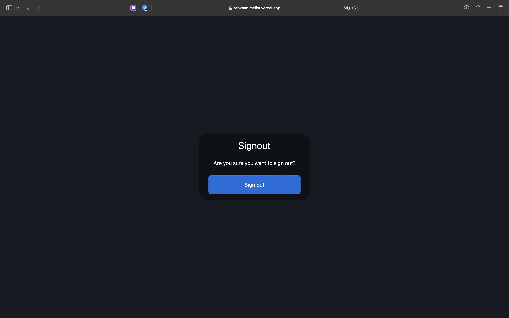

# Rabka Anime List

This project is a web application built using Next.js. It allows users to view and manage their anime list.

| Before Login                                                          | After Login                                                       | Detail Movie                                              |
| --------------------------------------------------------------------- | ----------------------------------------------------------------- | --------------------------------------------------------- |
|  |  |  |

| Profile                                          | My Collection                                               | My Comment                                            |
| ------------------------------------------------ | ----------------------------------------------------------- | ----------------------------------------------------- |
|  |  |  |

| Loading State                                 | Login GitHub                               | Logout GitHub                                |
| --------------------------------------------- | ------------------------------------------ | -------------------------------------------- |
|  |  |  |

## Requirements

- Node.js
- NPM or Yarn
- Supabase account

## Installation

1. Clone this repository to your local machine:

   ```bash
   git clone https://github.com/akbarekaputra01/rabkaanimelist.git
   cd rabkaanimelist
   ```

2. Install dependencies:

   ```bash
   npm install
   ```

3. Create a `.env` file from the `.env.example` template:

   ```bash
   cp .env.example .env
   ```

4. Update the contents of the `.env` file with your own information:

   - **GITHUB_CLIENT_ID** and **GITHUB_CLIENT_SECRET**:

     - Go to [GitHub Developer Settings](https://github.com/settings/developers).
     - Click **New OAuth App**.
     - Set the **Homepage URL** to `http://localhost:3000/` or your landing page URL.
     - Set the **Authorization callback URL** to `http://localhost:3000/api/auth/callback`.
     - Register the application, then copy the **Client ID** and **Client Secret** into your `.env` file.

   - **DATABASE_URL**:
     - Log in to [Supabase](https://supabase.io/).
     - Create a new project and copy your database password.
     - Once the project is set up, click the **Connect** button and copy your connection URL.
     - Paste the URL into your `.env` file and add the password you copied.

5. Run Prisma migrations to set up the database schema:

   ```bash
   npx prisma migrate dev
   ```

6. To run the project locally:

   ```bash
   npm run dev
   ```

## Contributing

If you would like to contribute to this project, please fork the repository and create a pull request with your changes.
